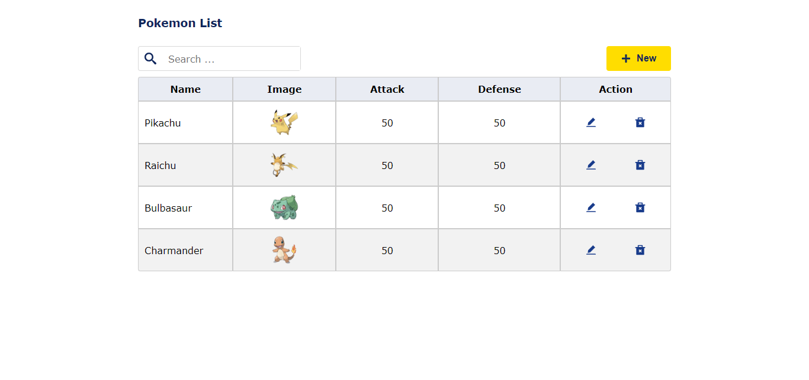
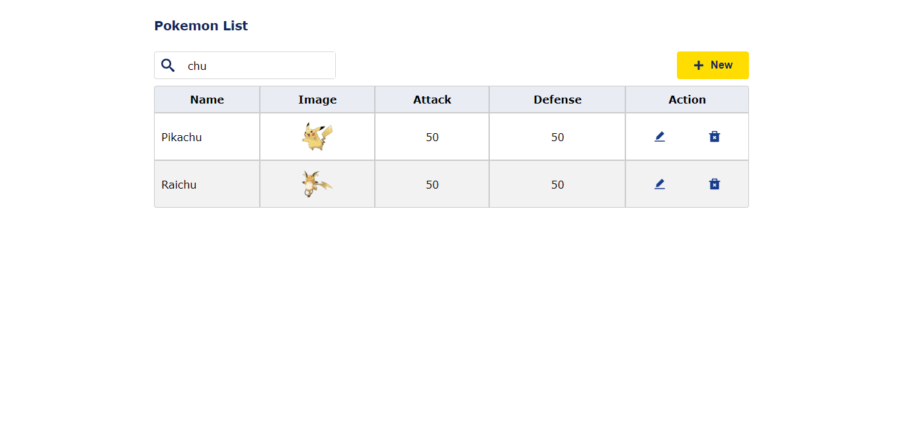
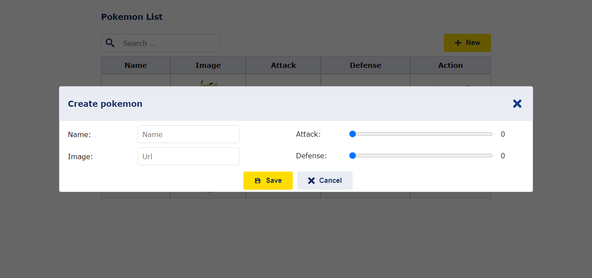
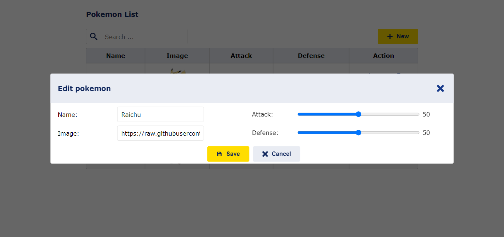
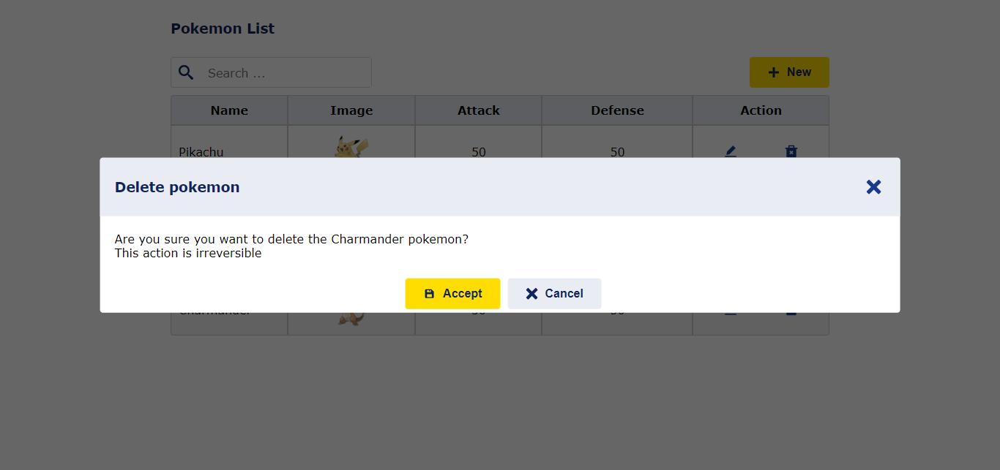
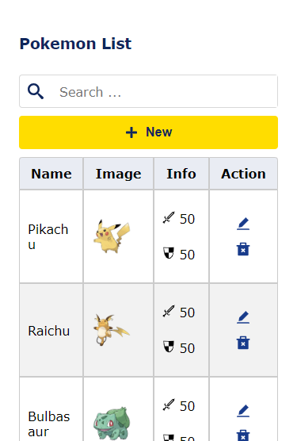
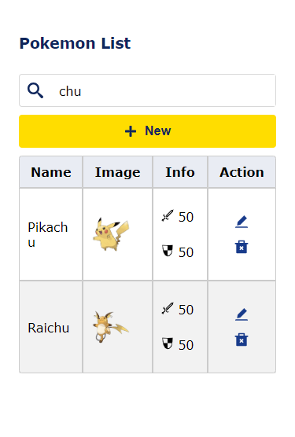
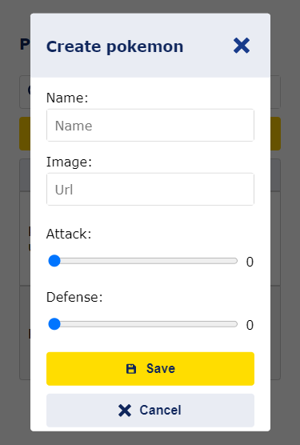
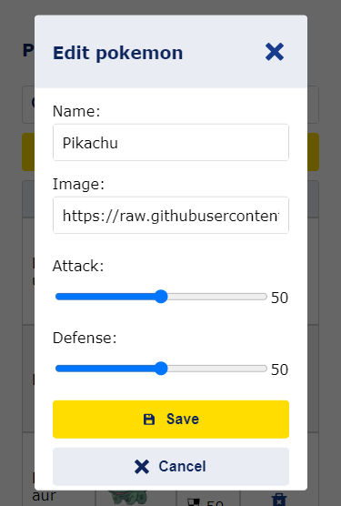
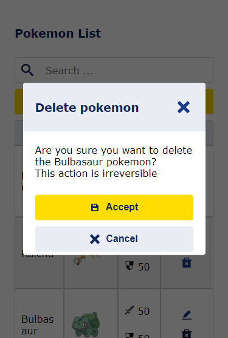

# Pokemon crud

Hi there👋 I'm `maikcodes`.

This project is React.js and CSS-only.

You can clone this repository and make changes as you wish

## Screenshots

### web

- main



- Filter



- Create



- Edit



- Delete



### mobile

- main



- Filter



- Create



- Edit



- Delete



## How to use

You can clone and download this repository. Maybe you would like to continue using the CSS-only version, or you can switch to [Tailwind CSS](https://tailwindcss.com/), [Bootstrap](https://getbootstrap.com/), or another CSS framework. The choice is yours!

I use [json-server](https://github.com/typicode/json-server) to create a fake API for this app to work with. Perhaps you'd like to use this repository to practice creating a RESTful API with any technology. Just go for it!

1. Clone this repository.
2. Install dependencies.

```powershell
npm i
```

3. Start the application.

```powershell
npm run dev
```

## How to use with json-server

If you are not familiar with json-server check some tutorial.

1. In your json-server make db.json like this:

```json
{
  "pokemons": [
    {
      "name": "Pikachu",
      "image_url": "https://raw.githubusercontent.com/PokeAPI/sprites/master/sprites/pokemon/other/official-artwork/25.png",
      "attack": "50",
      "defense": "50",
      "id": 1
    },
    {
      "name": "Raichu",
      "image_url": "https://raw.githubusercontent.com/PokeAPI/sprites/master/sprites/pokemon/other/official-artwork/26.png",
      "attack": "50",
      "defense": "50",
      "id": 2
    },
    {
      "name": "Bulbasaur",
      "image_url": "https://raw.githubusercontent.com/PokeAPI/sprites/master/sprites/pokemon/other/official-artwork/1.png",
      "attack": "50",
      "defense": "50",
      "id": 3
    },
    {
      "name": "Charmander",
      "image_url": "https://raw.githubusercontent.com/PokeAPI/sprites/master/sprites/pokemon/other/official-artwork/4.png",
      "attack": 50,
      "defense": 50,
      "id": 4
    }
  ]
}
```

2. Start json-server.
Note the PORT, change the port according to your needs (and check for the port in [PokemonRepository.js](https://github.com/maikcodes/pokemon-crud/blob/main/src/views/pokemon/PokemonRepository.js))

```powershell
npx json-server --port 3001 --watch db.json
```
